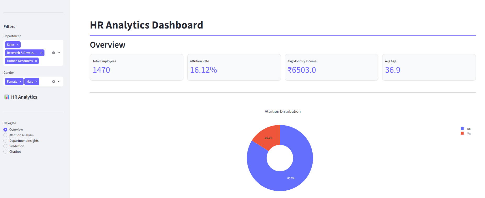
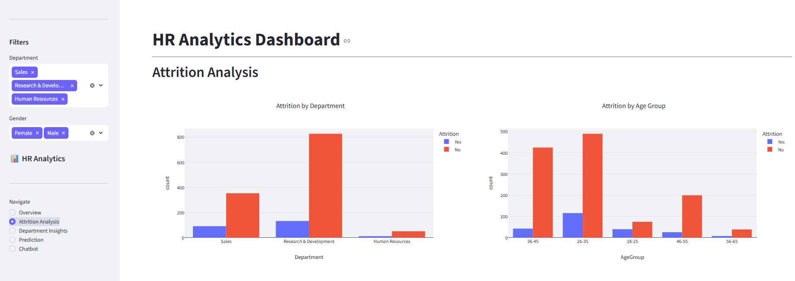
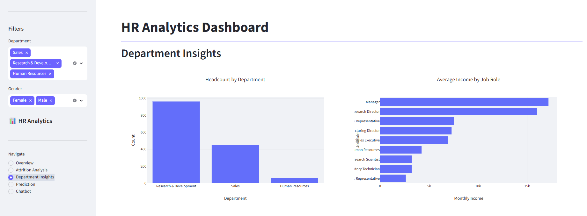
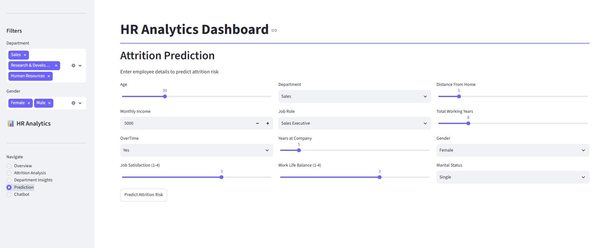
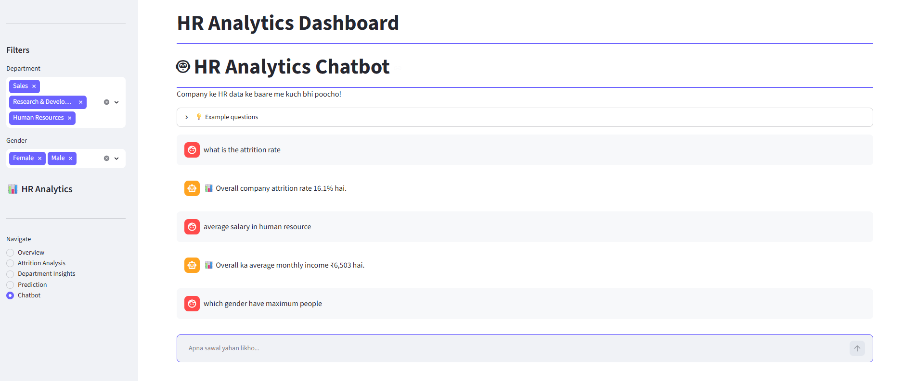

# 📊 HR Analytics Dashboard with AI Chatbot

An end-to-end HR Analytics platform built with **Python, Streamlit, and Machine Learning** — combining interactive data visualization, attrition prediction, and an AI-powered chatbot (rule-based + RAG) for querying HR data and company policies.

Built by [Priyansh](https://github.com/priyansh765)

---

## 🚀 Features

- **📈 Interactive Dashboard** — KPI cards, attrition trends, department-wise insights, built with Streamlit + Plotly
- **🎯 Attrition Prediction** — Random Forest ML model predicts employee attrition risk based on input features
- **🤖 AI Chatbot (Hybrid)**:
  - **Rule-based engine** — answers data/statistics questions directly from the dataset (attrition rate, salary, headcount, etc.)
  - **RAG-based engine** — answers HR policy questions using a local LLM (Ollama + LLaMA 3.2) with a vector database (ChromaDB) over company policy documents
- **🔍 Dynamic Filters** — filter all dashboard insights by Department and Gender
- **🎨 Polished UI** — custom theme, styled KPI cards, consistent chart color palette

---

## 🖼️ Screenshots

### Overview


### Attrition Analysis


### Department Insights


### Prediction


### AI Chatbot


---

## 🛠️ Tech Stack

| Category | Tools |
|---|---|
| Language | Python |
| Data Processing | Pandas |
| Visualization | Plotly, Streamlit |
| Machine Learning | Scikit-learn (Random Forest) |
| Chatbot / RAG | LangChain, ChromaDB, Ollama (LLaMA 3.2), Sentence-Transformers |
| Dataset | [IBM HR Analytics Employee Attrition (Kaggle)](https://www.kaggle.com/datasets/pavansubhasht/ibm-hr-analytics-attrition-dataset) |

---

## 🏗️ Architecture


Raw Data (CSV) → Data Cleaning & Feature Engineering (Pandas) → Streamlit Dashboard (Plotly) + ML Model (Random Forest) + Chatbot (Rule-Based on Pandas / RAG via LangChain + ChromaDB + Ollama LLM)

---

## 📂 Project Structure

- `app.py` — Main Streamlit app
- `data/raw/` — Original dataset
- `data/processed/` — Cleaned dataset
- `data/policies/` — HR policy documents (PDF/TXT)
- `data/vectorstore/` — ChromaDB vector store (auto-generated, gitignored)
- `notebooks/01_eda.ipynb` — Exploratory Data Analysis
- `notebooks/02_data_cleaning.ipynb` — Data cleaning & feature engineering
- `notebooks/03_model_training.ipynb` — ML model training
- `src/chatbot/rule_based_bot.py` — Keyword/intent-based chatbot
- `src/chatbot/rag_setup.py` — Vector DB builder
- `src/chatbot/rag_bot.py` — RAG chatbot (Ollama + ChromaDB)
- `src/chatbot/unified_bot.py` — Combines rule-based + RAG
- `src/models/` — Trained ML model artifacts
- `scripts/txt_to_pdf.py` — Utility script for policy PDF generation
- `docs/screenshots/` — Dashboard screenshots
- `requirements.txt` — Python dependencies


---

## ⚙️ Setup & Installation

### Prerequisites
- Python 3.10+
- [Ollama](https://ollama.com/download) installed (for the RAG chatbot)

### Steps

1. **Clone the repository**
```bash
git clone https://github.com/priyansh765/hr-analytics-dashboard-chatbot.git
cd hr-analytics-dashboard-chatbot
```

2. **Create and activate a virtual environment**
```bash
python -m venv venv
.\venv\Scripts\activate   # Windows
```

3. **Install dependencies**
```bash
pip install -r requirements.txt
```

4. **Pull the local LLM (Ollama)**
```bash
ollama pull llama3.2
```

5. **Build the vector database** (for the RAG chatbot)
```bash
python src/chatbot/rag_setup.py
```

6. **Run the app**
```bash
streamlit run app.py
```

---

## 🔮 Future Improvements

- Deploy on Streamlit Cloud / Hugging Face Spaces
- Add more HR policy documents to expand chatbot knowledge base
- Support multi-turn conversational memory in chatbot
- Add authentication for HR-only access

---

## 📄 License

This project is for educational/portfolio purposes, built using the publicly available IBM HR Analytics dataset.

---

## 🙋 Author

**Priyansh**
GitHub: [@priyansh765](https://github.com/priyansh765)